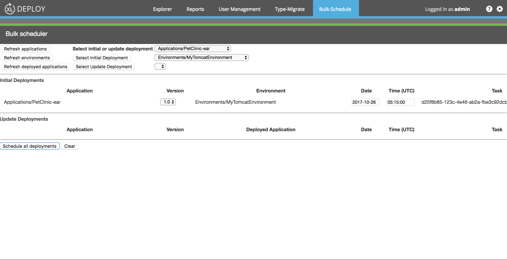

# XL Deploy Bulk Scheduler plugin

[![Build Status][xld-bulk-scheduler-plugin-travis-image]][xld-bulk-scheduler-plugin-travis-url]
[![License: MIT][xld-bulk-scheduler-plugin-license-image]][xld-bulk-scheduler-plugin-license-url]
![Github All Releases][xld-bulk-scheduler-plugin-downloads-image]

[xld-bulk-scheduler-plugin-travis-image]: https://travis-ci.org/xebialabs-community/xld-bulk-scheduler-plugin.svg?branch=master
[xld-bulk-scheduler-plugin-travis-url]: https://travis-ci.org/xebialabs-community/xld-bulk-scheduler-plugin
[xld-bulk-scheduler-plugin-license-image]: https://img.shields.io/badge/License-MIT-yellow.svg
[xld-bulk-scheduler-plugin-license-url]: https://opensource.org/licenses/MIT
[xld-bulk-scheduler-plugin-downloads-image]: https://img.shields.io/github/downloads/xebialabs-community/xld-bulk-scheduler-plugin/total.svg

## Preface

This document describes the functionality provided by the XL Deploy Bulk Scheduler plugin.

See the [XL Deploy reference manual](https://docs.xebialabs.com/xl-deploy) for background information on XL Deploy and deployment automation concepts.

## Overview

This plugin uses the XL Deploy UI extension mechanism to provide a panel that allows the user to schedule multiple deployments in a single action.

## Requirements

* XL Deploy 5.5+
* Any modern browser

## Installation

* Copy the latest JAR file from the [releases page](https://github.com/xebialabs-community/xld-bulk-scheduler-plugin/releases) into the `XL_DEPLOY_SERVER/plugins` directory.
* Restart the XL Deploy server.

## Usage

* On the Bulk-Schedule panel, begin by refreshing the Applications, Environments, and Deployed Applications dropdowns.

* Use the dropdowns to select an application and an environment for an initial deployment, or an application and a deployed application for an update deployment.

* Press the corresponding button to add the deployment to the appropriate table.  Once the deployment is in the table, select the application version and enter the date and time (UTC) for scheduling the deployment.

* Continue adding initial and update deployments to the tables, then press the Schedule All Deployments button. Each deployment may require a few seconds of processing, after which a task id will appear in the table.  Once the task id appears, the task is scheduled within XL Deploy.

* Errors will be indicated by JavaScript popups.  Processing will stop upon an error, leaving any as-yet unscheduled deployments to be resubmitted.

* Once the deployment tasks execute, they must be "closed" in order for them to appear within XL Deploy's reporting tab.  Open the task on the Task Monitor and press the Close button.

